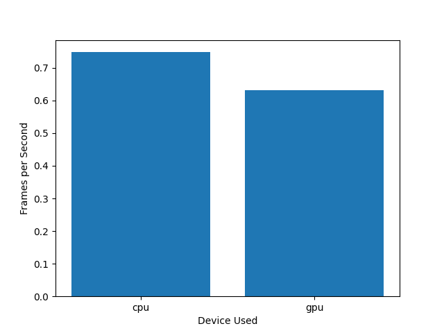
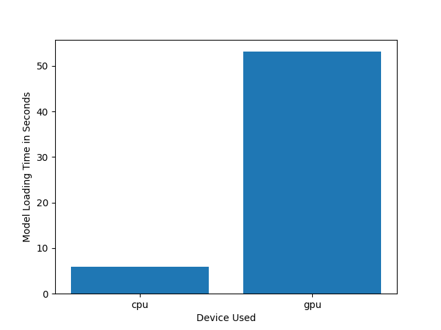
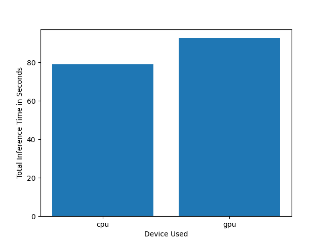
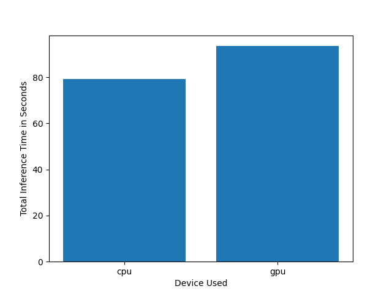
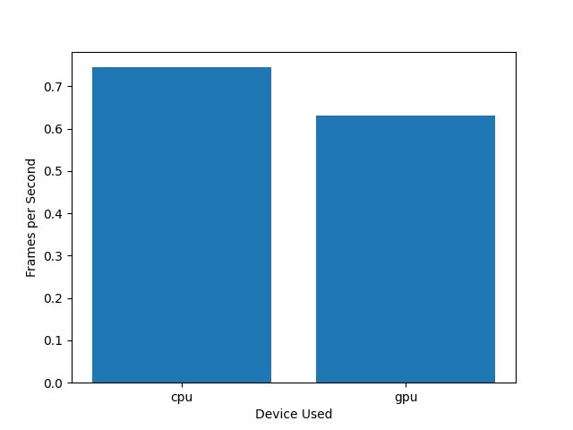
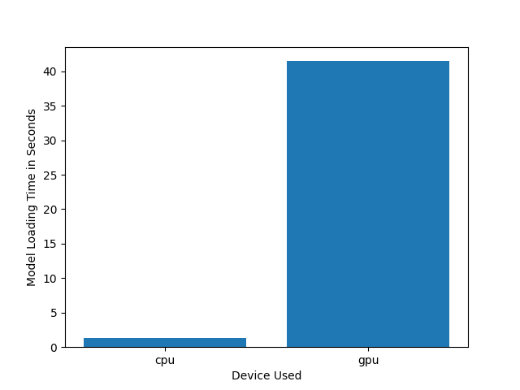
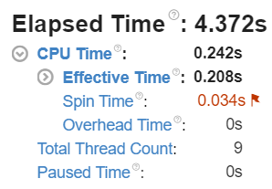
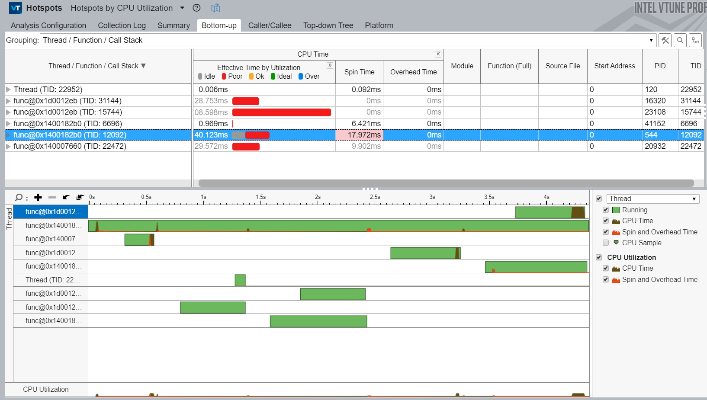

# Computer-Pointer-Controller

This project, use a gaze detection model to control the mouse pointer of a computer. The Gaze Estimation model is used to estimate the gaze of the user's eyes and change the mouse pointer position accordingly. This project was build using the InferenceEngine API from Intel's OpenVino ToolKit. 
More precisely the gaze estimation model take 3 inputs: 							
* The head pose
* The left eye image
* The right eye image					

These 3 inputs are collected with remedies of 3 models: 							
* Face Detection
* Head Pose Estimation
* Facial Landmarks Detection

In order to make this project work, a pipline was build to coordinate the flow of data from the input, and then amongst the different models and finally to the mouse controller

## Getting Started

### Prerequisites

### Install Intel® Distribution of OpenVINO™ toolkit

Please follow instructions provided by this [OpenVINO-guide](https://docs.openvinotoolkit.org/latest/) document.

### Download the project 

Clone the  provide [repository](https://github.com/gelhteag/Computer-Pointer-Controller)


### initialize openVINO Environment

For windows OS 

Open a command prompt in administrator mode add the following  line

```
cd C:\Program Files (x86)\IntelSWTools\openvino\bin\
```
then run 
```
setupvars.bat
```
### Download the pre-trainde models

 * [Face Detection Model](https://docs.openvinotoolkit.org/2020.2/_models_intel_face_detection_retail_0005_description_face_detection_retail_0005.html)
 * [Facial Landmarks Detection Model](https://docs.openvinotoolkit.org/latest/omz_models_intel_landmarks_regression_retail_0009_description_landmarks_regression_retail_0009.html)
 * [Head Pose Estimation Model](https://docs.openvinotoolkit.org/latest/omz_models_intel_head_pose_estimation_adas_0001_description_head_pose_estimation_adas_0001.html)
 * [Gaze Estimation Model](https://docs.openvinotoolkit.org/latest/omz_models_intel_gaze_estimation_adas_0002_description_gaze_estimation_adas_0002.html)

 #### Download the models by using openVINO model downloader
 ```
python <openvino directory>/deployment_tools/tools/model_downloader/downloader.py --name "face-detection-retail-0005"
```

```
python /opt/intel/openvino/deployment_tools/tools/model_downloader/downloader.py --name "gaze-estimation-adas-0002"
```
```
python /opt/intel/openvino/deployment_tools/tools/model_downloader/downloader.py --name "head-pose-estimation-adas-0001"
```
```
python /opt/intel/openvino/deployment_tools/tools/model_downloader/downloader.py --name "landmarks-regression-retail-0009"
```

## Demo

Open a command prompt, using cd go to the src directory of project repo and run the main.py scrypt

### For different hardware

* CPU
```
python main.py -fd intel/face-detection-retail-0005/FP32-INT8/face-detection-retail-0005 -hp intel/head-pose-estimation-adas-0001/FP32-INT8/head-pose-estimation-adas-0001 -fld intel/landmarks-regression-retail-0009/FP32-INT8/landmarks-regression-retail-0009 -g intel/gaze-estimation-adas-0002/FP32-INT8/gaze-estimation-adas-0002 -i bin/demo.mp4 --display_type video -d cpu
```
* GPU
```
python main.py -fd intel/face-detection-retail-0005/FP32-INT8/face-detection-retail-0005 -hp intel/head-pose-estimation-adas-0001/FP32-INT8/head-pose-estimation-adas-0001 -fld intel/landmarks-regression-retail-0009/FP32-INT8/landmarks-regression-retail-0009 -g intel/gaze-estimation-adas-0002/FP32-INT8/gaze-estimation-adas-0002 -i bin/demo.mp4 --display_type video -d gpu
```
* MYRIAD (VPU : NSC2)
```
python main.py -fd intel/face-detection-retail-0005/FP32-INT8/face-detection-retail-0005 -hp intel/head-pose-estimation-adas-0001/FP32-INT8/head-pose-estimation-adas-0001 -fld intel/landmarks-regression-retail-0009/FP32-INT8/landmarks-regression-retail-0009 -g intel/gaze-estimation-adas-0002/FP32-INT8/gaze-estimation-adas-0002 -i bin/demo.mp4 --display_type video -d myriad
```

* FPGA
```
python main.py -fd intel/face-detection-retail-0005/FP32-INT8/face-detection-retail-0005 -hp intel/head-pose-estimation-adas-0001/FP32-INT8/head-pose-estimation-adas-0001 -fld intel/landmarks-regression-retail-0009/FP32-INT8/landmarks-regression-retail-0009 -g intel/gaze-estimation-adas-0002/FP32-INT8/gaze-estimation-adas-0002 -i bin/demo.mp4 --display_type video -d hetero:cpu,fpga
```
[](https://youtu.be/q6CYru56RLc)


## Documentation
### Command Line Arguments for Running the app

Argument|Type|Description
| ------------- | ------------- | -------------
-fd | required | Path to face_detection_model model.
-hp | required | Path to head_pose_estimation_model model.
-fld| required | Path to facial landmark detection model.
-g| required | Path to gaze_estimation_model model.
-i| required | Path to image or video file.
-disp| Optional | Provide the source of video frames.
-ms_speed  | Optional | Provide the mouse speed needed values are fast-slow-medium.
-ms_prec | Optional | Provide the mouse precision needed values are high-low-medium.
-pt | Optional | Provide the probability threshold for detections filtering.
-d | Optional | Provide the target device: CPU / GPU / MYRIAD / FPGA.
-l | Optional | Provide the MKLDNN (CPU)-targeted custom layers.

### Directory Structure

- bin folder contains the media files.
- src folder contains the python scripts.
- readme file contain the description of the project and the how to used.

## Benchmarks

### Intel(R) Core(TM) i7-7500 CPU @ 2.70GHz 2.90GHZ

Precision| Inference Time | FPS | Model Loading Time
| ------------- | ------------- | ------------- | -------------
INT8 | |  | 
FP16 | |  | 
FP32 | |  | 

### Intel Vtune Profiler

VTune [Amplifier](https://software.intel.com/content/www/us/en/develop/tools/vtune-profiler.html) is an advanced profiler that can be used to find hotspots in our application code.
Running the app with cpu give the performance bellow which by the help of this tool give us the opportunity to improve the running time and the used of the cpu (hardaware).

Top Hotspots
    Function	Module	CPU Time
    func@0x1e0183ef	python36.dll	0.079s
    func@0x18009ee14	ucrtbase.dll	0.029s
    NtWaitForSingleObject	ntdll.dll	0.024s
    NtQueryAttributesFile	ntdll.dll	0.020s
    NtReadFile	ntdll.dll	0.013s
    [Others]	N/A*	0.077s
    




## Results
### Accuracy 

It can be seen that the precission effectively decreases from FP32 (Single-precision floating-point format) to FP 16 (
Half-precision floating-point format) to finish with INT8 due to the lower precision calculations.

### Loading time

The difference in loading time between the CPU and the GPU is significant and that regardless of the precision format.

### Software performance

As seen using Vtune Profiler, the improvement of the software architectur could considerably optimize the running time of the app.

## Stand Out Suggestions
Improvement could be come from the optimization of the softeware using Vtune profiler and also looking at the model optimization using the DL Workbench in order to reduce the sizes of the models that can be download [here](https://docs.openvinotoolkit.org/latest/workbench_docs_Workbench_DG_Install_Workbench.html).


### Edge Cases
* No face on the frame -> solution : the code will run inference at the condition of a face detect 
* Moving Mouse Pointer causing error when corner are getting (PyAutoGUI fail-safe triggered from mouse moving to a corner of the screen) can be solved (adding : pyautogui.FAILSAFE= True)
